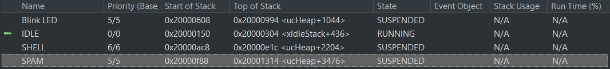
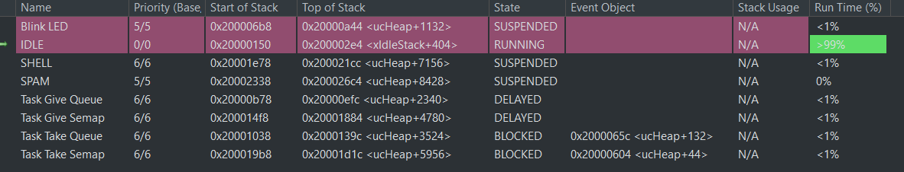

# TP_3DN_FreeRTOS

L’objectif de ce TP sur cinq séances est de mettre en place quelques applications
sous FreeRTOS en utilisant la carte STM32f746-Discovery conçue autour du
microcontrôleur STM32F746ng.

## FreeRTOS, tâches et sémaphores

Le paramètre TOTAL_HEAP_SIZE est important pour allouer le plus de place possible
dyanmiquement pour les variables.

Dans cette étape du TP nous en sommes rendu à créer des sémaphores et à jouer avec les priorités des tâches.
Nous avons deux tâches : task_give qui prend le sémaphore pour un délai de 100ms et task_take qui prend le sémaphore dès qu'il a l'occasion et le bloque.
Dans le cas où task_give est plus prioritaire, nous avons une sortie samblable à :

*Task give before
Task take before
Task take after
Task take before
Task give after
...*

Cela est dû au délai de 100ms. task_take à le temps de reprendre le sémaphore avant le "give after"

Lorsqu'on inverse les priorités; task_take plus prioritaire; nous avons : 

*Task take before
Task give before
Task take after
Task take before
Task give after
Task give before
Task take after
...*

La prochaine étape est de réaliser les tâches avec des notifications puis en utilisant une queue. (voir commit 36ac1130)
Pour les notifications, nous avons le même fonctionnement que pour le semaphore.

Le fonctionnement des queue est un peu différent. La queue met dans une fifo la valeur à envoyer et pour la réception, il faut lire la valeur.

*// send dans task1
q_value_send = i;
xQueueSend(QueueHandle, &q_value_send ,portMAX_DELAY);
vTaskDelay(portTICK_PERIOD_MS * 100 * i);

//receive dans task2
ret_q = xQueueReceive(QueueHandle, &q_value_receive ,1000);
if(ret_q != pdTRUE)
{
    NVIC_SystemReset();
    printf("System Reset\r\n");
}
printf("Received %d\r\n", q_value_receive);*

Pour la suite nous récupérons un projet avec un problème au lien : https://github.com/lfiack/tp_freertos_reentrance. 
Nous avons : 
#define TASK1_PRIORITY 1
#define TASK2_PRIORITY 2

#define TASK1_DELAY 1
#define TASK2_DELAY 2

et la sortie ressemble à : 

*Je suis la tache 2 et je m'endors pour 2 ticks
Je suis la tache 2 et je m'endors pour 2 ticks
Je suis la tache 1 et je m'endors pour 2 ticks
Je suis la tache 2 et je m'endors pour 2 ticks
Je suis la tache 2 et je m'endors pour 2 ticks
Je suis la tache 1 et je m'endors pour 2 ticks
...*

Le problème ici est que les deux tâches s'endors pour le même nombre de ticks alors que la tâche 1 doit s'endormir pour 1 tick.
Si on regarde le code, nous remarquons qu'ils accèdent au printf en même temps et donc influe sur la valeur. 
La tâche 2 étant initialisé en dernier, seul le TASK2_DELAY est pris en compte.
Pour résoudre le problème, il faut utiliser le sémaphore mutex. 

En rajoutant, une section critique autours des printf et en créeant cette fois-ci un semaphore mutex, nous avons : 

*Je suis la tache 2 et je m'endors pour 2 ticks
Je suis la tache 1 et je m'endors pour 1 ticks
Je suis la tache 2 et je m'endors pour 2 ticks
Je suis la tache 1 et je m'endors pour 1 ticks
Je suis la tache 2 et je m'endors pour 2 ticks
...*

Le problème est donc résolue.

## On joue avec le Shell

Seules les interruptions dont la priorité est supérieure à la valeur configLIBRARY_MAX_SYSCALL_INTERRUPT_PRIORITY (définie à 5 par défaut) peuvent appeler des primitives de FreeRTOS. 
On peut soit modifier ce seuil, soit modifier la priorité de l’interruption de l’USART1 (0 par défaut).

Pour faire fonctionner le shell en même temps que toutes les tâches; donc avec le scheduler; il faut créer une tâche pour le shell. 
Cette tâche réalise l'initialisation du shell et le run. Le run étant une boucle infinie, il bloque. 

Pour avoir un shell propre, il ne faut pas faire du polling dans le shell et écouter en permanance l'uart mais passer par une interruption de l'uart seulement lorsqu'il reçois un caractère.
Dans la fcontion de callback de cette interreption, on fais un notifyGive et dans la fonction uart_read() qui se trouve dans le shell.c, on fait un notify take. 

La prochaine étape et donc de créer une fonction qui viendra modifier le delay de la led sachant le led clignotte dans un tâche. 
Pour cela, il faut déclarer un static int delay. Static pour qu'il ne soit pas dans la pile. 
La fonction led(); dans le shell; aura comme argument le nouveau delay. La tâche led prendra donc en compte la variable globale delay pour son vTaskDelay().

La prochaine étape est de créer une tache spam qui s'éxécute en parallèle du clignottement de la led. Il spam le message msg avec une période delaymsg.

## Debug, gestion d’erreur et statistiques

### Gestion du tas
La zone réservé pour l'allocation dynamique s'appelle le tas. IL est géré par le HAL.
Avant de créer des tâches en boucle la RAM est utilisé à 5.93%.
Lorsqu'on créer des tâches bidon jusqu'à avoir une erreur, le code plante pour 10 task_bidon créée. Le total_heap_size du freeRTOS était par défault à 15360.
L'utilisation de la RAM passe à 5.74%.
On modifie le tas de la freeRTOS pour pouvoir en créer plus, on le passe à 153600.
Maintenant 123 tâches sont créer avant de planter. La RAM est uutilisé à 47.93%

### Gestion de la pile

RAPPEL :

Une variable interne à la fonction est dans la pile !
Une varibale globale et une variable static (interne ou non) est dans le segment de donnée (RAM) et est compilé !
Une variable alloué dynamiquement (malloc, alloc, creation de tache, semaphore, handle, notif, queue etc..) est dans le tas/

END RAPPEL

Pour cette partie notre objectif est de créer un overflow. 
Pour cela, d'après la documentation FreeRTOS, nous utilisons la fonction vApplicationStackOverflowHook appelé automatiquement en cas d'overflow. 
Cette fonction cligontera une led dans le cas overflow. 
Afin de tester, on créer une tache bidon qui créer un tableau énorme et qui se rempli.
Le tabeau prend une taille supérieure à la palce de la pile se qui créer notre cas. 
Pour le test, on passe en mode débug, on met un point d'arrêt puis on observe le code s'arrêter dans la fonction d'overflow.

### Statistiques dans l’IDE

L'objectif ici est d'observer les différent status de FreeRTOS. 
Pour cela on active :
— GENERATE_RUN_TIME_STATS
— USE_TRACE_FACILITY
— USE_STATS_FORMATTING_FUNCTIONS

On observe:

On créer deux taches queue et deux taches sémaphores. 

### Statistiques dans le shell

On utilise un timer assez rapide afin de compter le temps entre chaque tick de l'os. On utilise pour ca le TIMER2
vTaskGetRunTimeStats(pcWriteBuffer); //Cette fonction écrit dans le buffer passé en paramètre
printf("%s\r\n", pcWriteBuffer); //On récupère les données dans le buffer pour les mettres dans le printf. On affiche toutes les taches et leurs pourcentage d'utilisation
vTaskList(pcWriteBuffer); //Cette fonction écrit dans le buffer passé en paramètre
printf("%s\r\n", pcWriteBuffer);//On affiche la liste des taches et leurs consomation en ticks d'horloge

Etat d'utilisation du CPU :

	Task shell      35              <1%
	SPAM            56433           99%
	Task Take       0               <1%
	Task Give       0               <1%
	IDLE            0               <1%

	Task shell      X       6       76      4
	SPAM            R       4       230     1
	Task Take       R       3       245     3
	Task Give       R       2       245     2
	IDLE            R       0       118     5

## Création d'un driver 

### DEV ID
On commence par assigner des pins pour la connexion avec l'ADXL345.
En premier test nous allons voir le DEVID qui se prononce : "Dèv Id"
Pour une communication en SPI on utilise la fonction HAL_SPI_Transmit et Receive.

	uint8_t address = 0x00; //Addresse du DEVID donnée dans la doc
	uint8_t p_data;		//Pointeur de la data
	uint16_t size = 1;	//Taille en octet de la longueur de la transmission
	HAL_GPIO_WritePin(NSS_GPIO_Port, NSS_Pin, GPIO_PIN_RESET); //ChipSelect a 0 pour s'adresser au ADXL
	HAL_SPI_Transmit(&hspi2, &address, 1, HAL_MAX_DELAY); //On transmet à l'adresse 0x00
	HAL_SPI_Receive(&hspi2, &p_data, size, HAL_MAX_DELAY); // On recoit en SPI de la data que l'on enregistre dans le pointeur p_data
	HAL_GPIO_WritePin(NSS_GPIO_Port, NSS_Pin, GPIO_PIN_SET); //On remet le chipSelect a 1
	printf("%X \r\n", p_data); // On printf la valeur renvoyé, dans notre cas 229, 0x2E ce qui est la rst value

### Communication pour reception de donnée de l'acceleromètre
Le but est d'échanger des données lorsque l'acceleromètre les as calculé. Le fonctionnement est le suivant : Nous initalisons l'acc en changant les valeur des registres 
POWER_CTL et INIT_ENABLE. Par la suite on attend que le pin INT (qui correspond a un interruption de l'acc) passe à '1'. Lorsque cela arrive nous faisons une lecture multiple
des registres data 0 et 1 de chacun des axes X,Y,Z. Cela se fait par une fonction réaliser dans le fichier ADXL345.c

Fonction lecture des valeurs de l'acc

	void ACC_READ_Mult(uint8_t* p_data, uint8_t address, uint16_t size){
	address |= 0x80; //Active le bit de lecture 
	address |= 0b01000000; //Active le 'multiple bit' afin de pouvoir lire toute la data de chaque axe
	HAL_GPIO_WritePin(NSS_GPIO_Port, NSS_Pin, GPIO_PIN_RESET); //ChipSelect a 0
	HAL_SPI_Transmit(&hspi2, &address, 1, HAL_MAX_DELAY); //On transmet a l'adresse
	HAL_SPI_Receive(&hspi2, p_data, size, HAL_MAX_DELAY); // On recoit en SPI de la data sur size octets (ici 6)
	HAL_GPIO_WritePin(NSS_GPIO_Port, NSS_Pin, GPIO_PIN_SET); //On remet le chipSelect a 1
	}

Code permettant de lire les données de l'acc

	uint8_t address = 0x32;
	uint16_t size = 6;
	uint8_t p_data[size];	// p_data c'est un pointeur sur le premier element du tableau
							// donc c'est un uint8_t*
							// *p_data, c'est la valeur pointée (du premier élément du tableau)
							// il n'y a pas de sens à écrire &p_data

	while(HAL_GPIO_ReadPin(INT_GPIO_Port, INT_Pin) == 0);//On attend l'interruption du INT_Pin
	ACC_READ_Mult(p_data, address, size);
	//Conversion et concaténation des données selon les trois axes 
	int16_t acc_x = (int16_t)p_data[0] | ((int16_t)p_data[1]) << 8;
	int16_t acc_y = (int16_t)p_data[2] | ((int16_t)p_data[3]) << 8;
	int16_t acc_z = (int16_t)p_data[4] | ((int16_t)p_data[5]) << 8;
	printf("Valeur d'acc : %d, %d, %d \r\n", acc_x, acc_y, acc_z);

Le résultat : Valeur d'acc : -69, -174, -196
